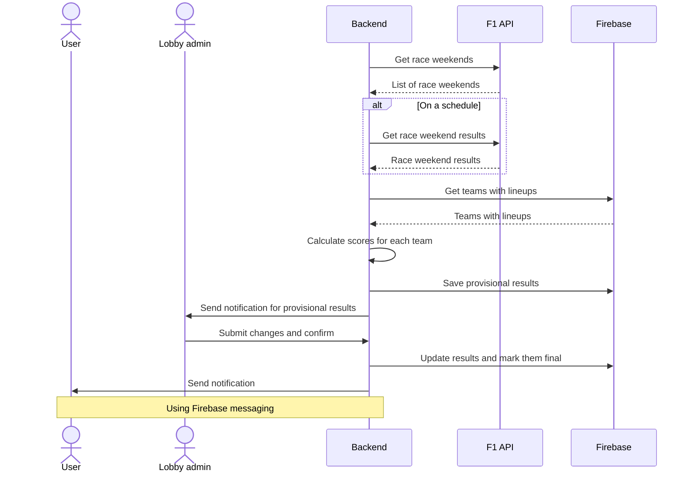
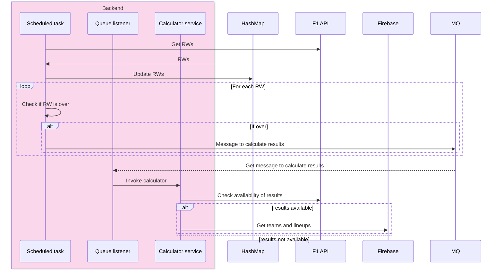

# Score calculator design

## Introduction

After a race weekend is over, we need to calculate the scores for each team
that's registered in the app. Ideally, this
process will be as automatic as possible, depending of course on the
availability of the data needed for the
calculation.

We also need to consider that the calculation process could be time consuming,
so it should be done asynchronously.
Also, when the scores are available, a notification should go out to the app's
users.

## Requirements

* System should detect when a race weekend is over

* It should check for availability of data to do the calculations

* Once data is available, calculate scores for each team

* Once calculations are complete, send notification to lobby admin for review

* Lobby admin can view and change scores for each team in the lobby

* Lobby admin confirms scoring

* System makes necessary updates

* Notifications are sent to each team in the lobby once admin has confirmed

## Sequence diagram

## Implementation

### Scheduled process

On an hourly basis, the system should look up the list of race weekends and
check for changes in the schedule. Meanwhile it would also check if any race
weekend is over and add a message to a queue to check the availability
of results for that weekend.

